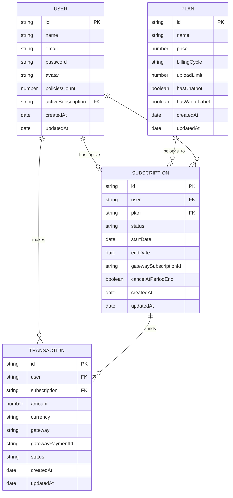

# 🗄️ Database Schema Documentation — Subscriptions & Payments

This document outlines the database schema design, entity relationships, and collections for managing user plans, subscriptions, and transaction logs.

---

## 🗺️ Entity Relationship (ER) Diagram

The following Mermaid diagram shows how our collections connect in MongoDB. We use references (`ObjectId`) to establish relational mappings.

---

## 🗂️ Collection Details

### 1. `users` (Modified)
Holds basic user authentication and profile data, along with a link to their current active billing plan.

*   `activeSubscription`: Reference ID to the `subscriptions` collection. If `null`, the user defaults to **Free Tier limits** (max 1 policy upload, standard summaries only).

### 2. `plans` (New)
Defines static features, limits, and pricing metadata. This allows changing subscription boundaries dynamically in MongoDB without editing backend code.

*   `name`: Unique string key (e.g. `'free'`, `'premium'`, `'agent_pro'`).
*   `price`: Cost in the local currency unit.
*   `uploadLimit`: Maximum uploads allowed per month.
*   `hasChatbot`: Unlocks the interactive policy chat.
*   `hasWhiteLabel`: Unlocks logo uploading and customized exports.

### 3. `subscriptions` (New)
Tracks the start, end, and status of a user's subscription contract.

*   `user`: Reference to the `User` owner.
*   `plan`: Reference to the purchased `Plan`.
*   `status`: Current state (e.g., `'active'` when paid, `'canceled'` when cancelled, `'past_due'` when renewal fails).
*   `endDate`: Expiration timestamp. Any requests beyond this time will treat the user as a Free tier member.

### 4. `transactions` (New)
Serves as an immutable financial ledger, storing details of every charge event for receipt audit trails.

*   `user`: Reference to the paying `User`.
*   `subscription`: Reference to the funded `Subscription`.
*   `amount`: The charged amount (decimals supported).
*   `gateway`: Payment provider used (`'stripe'` or `'razorpay'`).
*   `gatewayPaymentId`: Unique transaction ID provided by Stripe (`ch_xxx` / `pi_xxx`) or Razorpay (`pay_xxx`).
