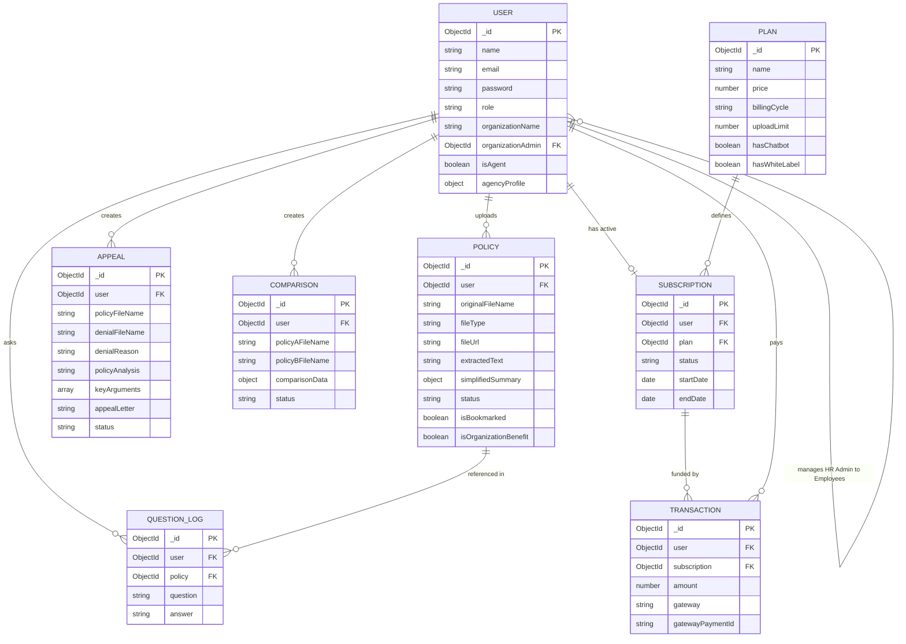

# 🗄️ Database Schema & ER Diagram Documentation

This document outlines the complete database schema design, entity relationships, Crow's foot notation guide, and collection details for the **AI Insurance Policy Simplifier** system.

---

## 🗺️ Entity Relationship (ER) Diagram

```mermaid
erDiagram
    USER ||--o{ POLICY : "uploads"
    USER ||--o{ APPEAL : "creates"
    USER ||--o{ COMPARISON : "creates"
    USER ||--o{ QUESTION_LOG : "asks"
    USER ||--o| SUBSCRIPTION : "has active"
    USER ||--o{ USER : "manages HR Admin to Employees"

    POLICY ||--o{ QUESTION_LOG : "referenced in"
    PLAN ||--o{ SUBSCRIPTION : "defines"
    SUBSCRIPTION ||--o{ TRANSACTION : "funded by"
    USER ||--o{ TRANSACTION : "pays"

    USER {
        ObjectId _id PK
        string name
        string email
        string password
        string role
        string organizationName
        ObjectId organizationAdmin FK
        boolean isAgent
        object agencyProfile
    }

    POLICY {
        ObjectId _id PK
        ObjectId user FK
        string originalFileName
        string fileType
        string fileUrl
        string extractedText
        object simplifiedSummary
        string status
        boolean isBookmarked
        boolean isOrganizationBenefit
    }

    APPEAL {
        ObjectId _id PK
        ObjectId user FK
        string policyFileName
        string denialFileName
        string denialReason
        string policyAnalysis
        array keyArguments
        string appealLetter
        string status
    }

    COMPARISON {
        ObjectId _id PK
        ObjectId user FK
        string policyAFileName
        string policyBFileName
        object comparisonData
        string status
    }

    QUESTION_LOG {
        ObjectId _id PK
        ObjectId user FK
        ObjectId policy FK
        string question
        string answer
    }

    PLAN {
        ObjectId _id PK
        string name
        number price
        string billingCycle
        number uploadLimit
        boolean hasChatbot
        boolean hasWhiteLabel
    }

    SUBSCRIPTION {
        ObjectId _id PK
        ObjectId user FK
        ObjectId plan FK
        string status
        date startDate
        date endDate
    }

    TRANSACTION {
        ObjectId _id PK
        ObjectId user FK
        ObjectId subscription FK
        number amount
        string gateway
        string gatewayPaymentId
    }
```

---

## 🔣 Complete ER Diagram Symbol & Cardinality Notation Guide

### 1. Key Identifiers & Field Badges
* **`PK` (Primary Key):** The unique identifier assigned to a document in MongoDB (represented by `_id`).
* **`FK` (Foreign Key):** A field storing an `ObjectId` reference pointing to the `_id` of a document in another MongoDB collection.
* **`ObjectId`:** MongoDB's 24-character BSON hexadecimal identifier type used for document references.

### 2. Crow's Foot Cardinality Symbols Guide

| Symbol | Notation Name | Meaning & Description |
| :---: | :--- | :--- |
| **`||--||`** | **One-to-One (Mandatory)** | Exactly 1 entity on the left maps to exactly 1 entity on the right. |
| **`||--o|`** | **One-to-Zero-or-One (Optional)** | Exactly 1 entity on the left maps to **at most zero or one** entity on the right. *(Example: `USER ||--o| SUBSCRIPTION` $\rightarrow$ A user has 0 or 1 active subscription).* |
| **`||--|{`** | **One-to-One-or-Many (Mandatory)** | Exactly 1 entity on the left maps to **at least 1 or many** entities on the right. |
| **`||--o{`** | **One-to-Zero-or-Many (Optional)** | Exactly 1 entity on the left maps to **0, 1, or many** entities on the right. *(Example: `USER ||--o{ POLICY` $\rightarrow$ A user can upload 0 or many policies).* |
| **`}o--o{`** | **Many-to-Many (Optional)** | Multiple entities on the left map to multiple entities on the right. |

---

## 🗂️ Collection Details — What Each Entity Stores

### 1. `users`
Holds user accounts, authentication credentials, role access levels, and organizational hierarchy references.
* **`role`**: Options are `'user'`, `'agent'`, `'hr-admin'`, `'employee'`.
* **`organizationAdmin`**: Foreign Key referencing the HR Admin's `_id` for corporate employee users.

### 2. `policies`
Stores uploaded policy PDFs/images, extracted raw OCR text, and Gemini AI simplified outputs.
* **`fileUrl`**: Cloudinary hosted document URL.
* **`simplifiedSummary`**: Structured JSON returned by Gemini AI (policy type, coverage, exclusions, claim steps).
* **`isOrganizationBenefit`**: True when uploaded by HR for employee viewing.

### 3. `appeals`
Contains claim denial appeal letters generated by Gemini AI.
* **`appealLetter`**: Formatted legal letter text to submit to insurance providers.

### 4. `comparisons`
Stores side-by-side coverage analysis of two policies.

### 5. `questionlogs`
Stores audit trails of employee AI questions regarding corporate benefit policies.

### 6. `plans`
Defines subscription tiers, upload quotas, pricing, and feature flags.

### 7. `subscriptions`
Tracks active, canceled, or past-due user membership contracts and expiration dates (`endDate`).

### 8. `transactions`
Immutable financial record storing payment amounts, gateways (`'stripe'` | `'razorpay'`), and transaction IDs (`gatewayPaymentId`).

---

## 🔗 Entity Relationships Explained

1. **`USER ||--o{ POLICY`**: 1 User uploads 0 or many Policies.
2. **`USER ||--o{ APPEAL`**: 1 User creates 0 or many Claim Appeals.
3. **`USER ||--o{ COMPARISON`**: 1 User generates 0 or many Policy Comparisons.
4. **`USER ||--o{ QUESTION_LOG`**: 1 Employee asks 0 or many benefit questions.
5. **`POLICY ||--o{ QUESTION_LOG`**: 1 Corporate Policy can be referenced in many Q&A logs.
6. **`USER ||--o| SUBSCRIPTION`**: 1 User has at most 1 Active Subscription.
7. **`USER ||--o{ USER`**: 1 HR Admin manages many Employee accounts.
8. **`PLAN ||--o{ SUBSCRIPTION`**: 1 Plan defines many User Subscriptions.
9. **`SUBSCRIPTION ||--o{ TRANSACTION`**: 1 Subscription is funded by 1 or many Transactions.
10. **`USER ||--o{ TRANSACTION`**: 1 User makes 0 or many Payment Transactions.
