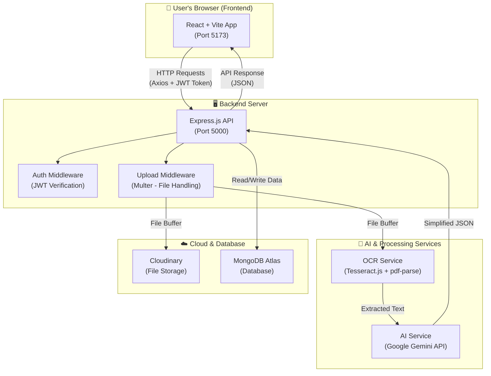
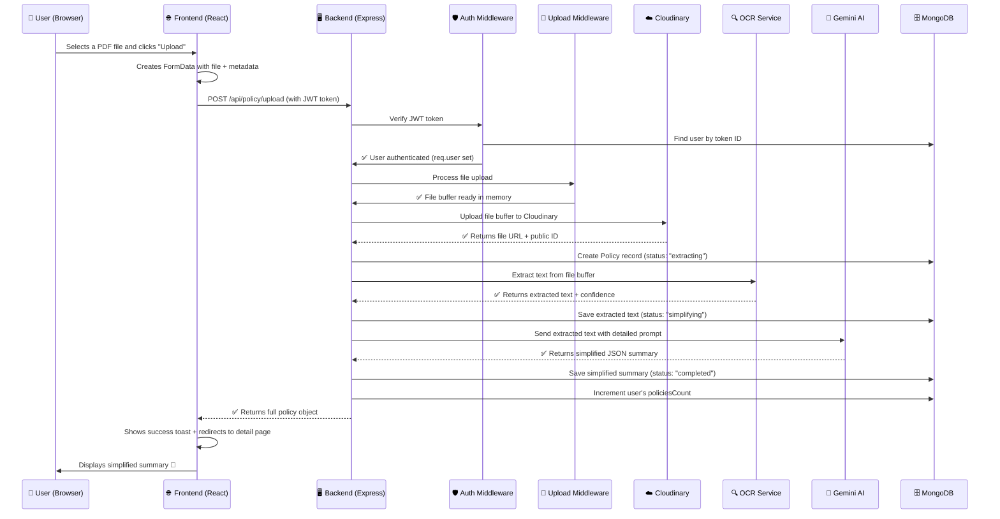
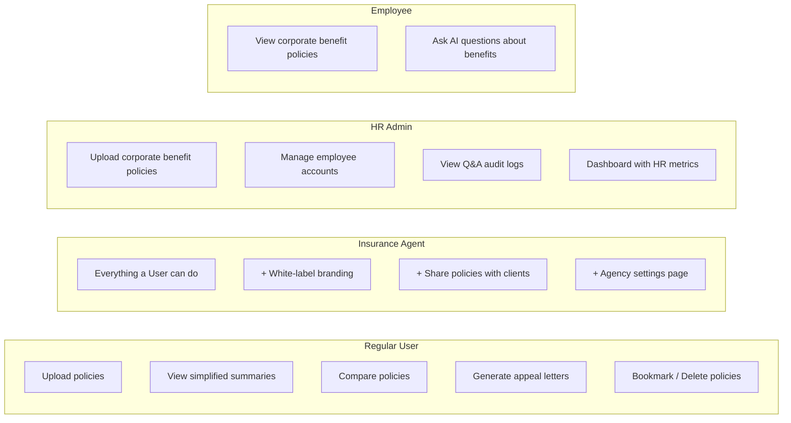
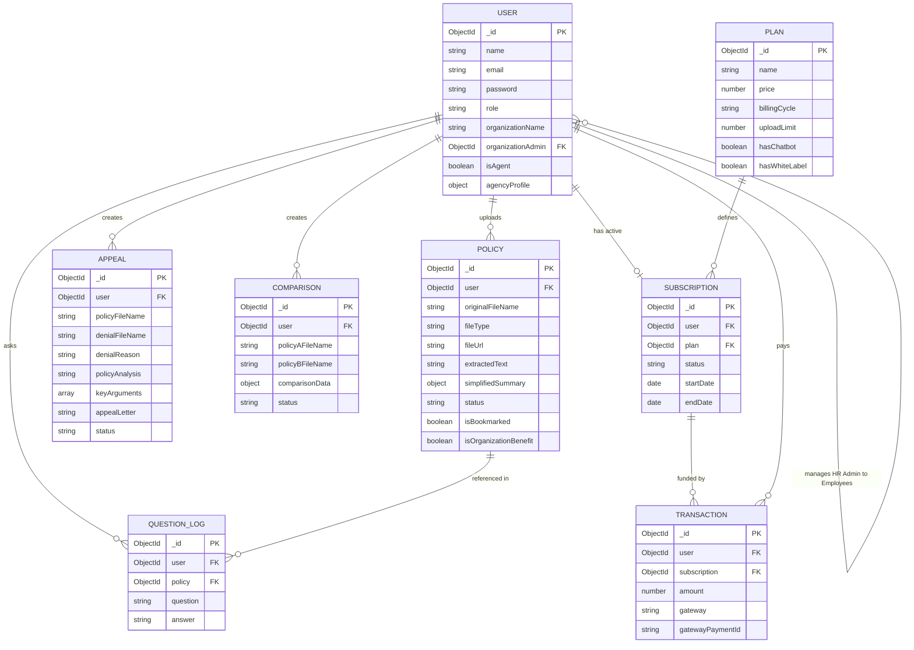

# 🏗️ AI Insurance Policy Simplifier — Complete Project Architecture

> **What does this project do?**
> This is a full-stack web application that uses **Google Gemini AI** to take complex insurance policy documents (PDFs or images), extract the text from them, and convert that hard-to-read legal jargon into **simple, easy-to-understand English summaries**. It also supports comparing two policies side-by-side, generating appeal letters for denied claims, and an HR Benefits portal for corporate use.

---

## 📑 Table of Contents

1. [High-Level Architecture Diagram](#1-high-level-architecture-diagram)
2. [Technology Stack — What & Why](#2-technology-stack--what--why)
3. [Project Folder Structure Explained](#3-project-folder-structure-explained)
4. [Backend Deep Dive](#4-backend-deep-dive)
   - [Server Entry Point](#41-server-entry-point-serverjs)
   - [API Routes & Endpoints (Complete Map)](#42-api-routes--endpoints-complete-map)
   - [Controllers — What Each One Does](#43-controllers--what-each-one-does)
   - [Services — The AI, OCR & Cloud Engines](#44-services--the-ai-ocr--cloud-engines)
   - [Middleware — Security & File Handling](#45-middleware--security--file-handling)
   - [Database Models — Data Shape](#46-database-models--data-shape)
   - [Utilities](#47-utilities)
   - [Configuration](#48-configuration)
5. [Frontend Deep Dive](#5-frontend-deep-dive)
   - [App Entry & Routing](#51-app-entry--routing)
   - [Pages — What Each Screen Does](#52-pages--what-each-screen-does)
   - [Components — Reusable UI Pieces](#53-components--reusable-ui-pieces)
   - [State Management (Recoil)](#54-state-management-recoil)
   - [Custom Hooks — Reusable Logic](#55-custom-hooks--reusable-logic)
   - [API Layer](#56-api-layer)
6. [Complete Data Flow — Upload to Simplified Summary](#6-complete-data-flow--upload-to-simplified-summary)
7. [User Roles & Permissions](#7-user-roles--permissions)
8. [Environment Variables](#8-environment-variables)
9. [Entity-Relationship Diagram](#9-entity-relationship-diagram)
10. [How to Run the Project](#10-how-to-run-the-project)

---

## 1. High-Level Architecture Diagram



### How it works in simple words:

1. **User opens the website** → The React frontend loads in the browser
2. **User uploads a policy PDF/image** → The file is sent to the Express backend
3. **Backend stores the file** → It uploads to Cloudinary (cloud storage)
4. **Backend reads the text** → Uses OCR (Tesseract.js) for images or pdf-parse for PDFs
5. **Backend sends text to AI** → Google Gemini reads the text and returns a simple summary
6. **Everything is saved** → The original file URL, extracted text, and simplified summary are stored in MongoDB
7. **User sees the result** → The frontend displays a beautiful, easy-to-read summary

---

## 2. Technology Stack — What & Why

### 🔵 Frontend Technologies

| Technology | Version | What It Does | Why It's Used |
|---|---|---|---|
| **React** | 18.3 | Builds the entire user interface (UI) | The most popular UI library. It lets us build interactive, fast web pages using reusable "components" (like Lego blocks for websites) |
| **Vite** | 8.1 | Development server & build tool | Vite is *extremely fast* — it makes your code reload instantly when you save changes during development, unlike older tools like Webpack |
| **React Router DOM** | 6.22 | Handles page navigation (URLs) | Lets users navigate between pages (`/dashboard`, `/upload`, `/policy/123`) without full page reloads — feels like a native app |
| **Recoil** | 0.7 | Global state management | Stores data (like logged-in user info, policy list) that multiple components need to access. It's simpler than Redux |
| **Axios** | 1.6 | Makes HTTP requests to the backend | A clean, feature-rich HTTP client. It supports interceptors (auto-attach JWT token to every request), timeouts, and error handling |
| **TailwindCSS** | 4.0 | CSS styling framework | Utility-first CSS — lets you style components quickly with class names like `bg-blue-500 text-white p-4` instead of writing separate CSS files |
| **React Icons** | 5.0 | Icon library | Provides thousands of icons (from FontAwesome, Material Design, etc.) as React components |
| **React Hot Toast** | 2.4 | Notification popups (toasts) | Shows success/error messages like "Policy uploaded!" or "Login failed" as small popup notifications |
| **jsPDF** | 4.2 | Generate PDF files in the browser | Lets users download their simplified policy summaries as PDF documents |

### 🟢 Backend Technologies

| Technology | Version | What It Does | Why It's Used |
|---|---|---|---|
| **Node.js** | — | JavaScript runtime on the server | Lets us write the backend in JavaScript (same language as frontend) — one language for everything |
| **Express.js** | 4.18 | Web server framework | The most popular Node.js framework. It handles incoming HTTP requests, defines routes (`/api/policy/upload`), and sends responses |
| **Mongoose** | 8.1 | MongoDB Object Data Modeling (ODM) | Lets us define data schemas (what data looks like) and interact with MongoDB using simple JavaScript code instead of raw database queries |
| **JSON Web Token (JWT)** | 9.0 | User authentication tokens | After login, the server gives the user a "token" (like a digital ID card). The user sends this token with every request to prove they're logged in |
| **bcryptjs** | 2.4 | Password hashing | Converts passwords into unreadable strings before storing in the database. Even if someone steals the database, they can't see real passwords |
| **Multer** | 1.4 | File upload handling | Processes file uploads from the frontend. Stores them temporarily in memory (as a buffer) before we send them to Cloudinary |
| **@google/generative-ai** | 0.21 | Google Gemini AI SDK | The official library to call Google's Gemini AI models. This is the brain of our app — it reads policy text and generates simplified summaries |
| **Tesseract.js** | 5.0 | OCR (Optical Character Recognition) | Reads text from *images*. If someone uploads a photo of their policy, Tesseract scans the image and extracts the text from it |
| **pdf-parse** | 1.1 | PDF text extraction | Reads text from *digital PDFs*. Most modern PDFs have selectable text — this library extracts it without needing OCR |
| **Cloudinary** | 2.0 | Cloud file storage | Stores uploaded files (PDFs, images) in the cloud. We get a URL back that we can use to access the file later. This avoids storing files on our own server |
| **Morgan** | 1.10 | HTTP request logger | Logs every API request in the console during development (e.g., `GET /api/policy 200 45ms`) — helps with debugging |
| **dotenv** | 16.4 | Environment variable loader | Reads secret keys (API keys, database passwords) from a `.env` file so we never hardcode them in our source code |
| **express-validator** | 7.0 | Input validation | Validates incoming request data (e.g., "is this a valid email?", "is the password long enough?") |
| **CORS** | 2.8 | Cross-Origin Resource Sharing | Allows the frontend (running on `localhost:5173`) to make requests to the backend (running on `localhost:5000`). Without CORS, the browser would block these requests |

### 🔶 Cloud Services

| Service | Purpose |
|---|---|
| **MongoDB Atlas** | Cloud-hosted database — stores all users, policies, appeals, comparisons |
| **Cloudinary** | Cloud file storage — stores uploaded PDFs and images, returns URLs |
| **Google Gemini AI** | AI language model — reads insurance text, generates simplified summaries, appeal letters, comparisons, and benefits Q&A |

---

## 3. Project Folder Structure Explained

```
AI-Insurance-Policy-Simplifier/
│
├── backend/                          ← 🖥️ THE SERVER (Node.js + Express)
│   ├── config/
│   │   └── db.js                     ← Connects to MongoDB Atlas database
│   │
│   ├── controllers/                  ← 🧠 BUSINESS LOGIC (the "brains")
│   │   ├── authController.js         ← Login, Register, Profile logic
│   │   ├── policyController.js       ← Upload, Simplify, Delete policy logic
│   │   ├── appealController.js       ← Claim denial appeal letter logic
│   │   ├── comparisonController.js   ← Side-by-side policy comparison logic
│   │   └── hrController.js           ← HR Admin & Employee portal logic
│   │
│   ├── middleware/                   ← 🛡️ GATEKEEPERS (run before controllers)
│   │   ├── authMiddleware.js         ← Checks if user is logged in (JWT token)
│   │   ├── uploadMiddleware.js       ← Handles file uploads (Multer)
│   │   └── errorMiddleware.js        ← Catches errors and sends clean responses
│   │
│   ├── models/                       ← 📦 DATA SCHEMAS (what data looks like in MongoDB)
│   │   ├── User.js                   ← User account data shape
│   │   ├── Policy.js                 ← Insurance policy data shape
│   │   ├── Appeal.js                 ← Claim appeal data shape
│   │   ├── Comparison.js             ← Policy comparison data shape
│   │   ├── QuestionLog.js            ← Employee benefits Q&A log
│   │   ├── Plan.js                   ← Subscription plan tiers
│   │   ├── Subscription.js           ← User subscription records
│   │   └── Transaction.js            ← Payment transaction records
│   │
│   ├── routes/                       ← 🛤️ URL ROUTING (maps URLs → controllers)
│   │   ├── authRoutes.js             ← /api/auth/* routes
│   │   ├── policyRoutes.js           ← /api/policy/* routes
│   │   ├── appealRoutes.js           ← /api/appeal/* routes
│   │   ├── comparisonRoutes.js       ← /api/comparison/* routes
│   │   └── hrRoutes.js               ← /api/hr/* routes
│   │
│   ├── services/                     ← ⚙️ EXTERNAL SERVICE INTEGRATIONS
│   │   ├── aiService.js              ← Google Gemini AI calls (simplify, appeal, compare, Q&A)
│   │   ├── ocrService.js             ← Text extraction (Tesseract + pdf-parse)
│   │   └── cloudinaryService.js      ← Cloud file upload/delete
│   │
│   ├── utils/                        ← 🔧 HELPER FUNCTIONS
│   │   └── generateToken.js          ← Creates JWT authentication tokens
│   │
│   ├── server.js                     ← 🚀 MAIN ENTRY POINT — starts the server
│   ├── package.json                  ← Backend dependencies list
│   ├── .env                          ← Secret keys (never commit to Git!)
│   └── .env.example                  ← Template showing which keys are needed
│
├── frontend/                         ← 🌐 THE WEBSITE (React + Vite)
│   ├── src/
│   │   ├── api/
│   │   │   └── axiosInstance.js      ← Configured HTTP client (auto-attaches JWT)
│   │   │
│   │   ├── atoms/                    ← 🧪 GLOBAL STATE (Recoil atoms)
│   │   │   ├── authAtom.js           ← Stores logged-in user data
│   │   │   └── policyAtom.js         ← Stores policies list, selected policy, stats
│   │   │
│   │   ├── components/               ← 🧩 REUSABLE UI PIECES
│   │   │   ├── common/               ← Shared across all pages
│   │   │   │   ├── Navbar.jsx        ← Top navigation bar (public pages)
│   │   │   │   ├── Footer.jsx        ← Page footer
│   │   │   │   ├── Sidebar.jsx       ← Left sidebar (dashboard pages)
│   │   │   │   ├── DashboardHeader.jsx ← Top bar in dashboard
│   │   │   │   ├── DashboardLayout.jsx ← Layout wrapper (sidebar + content)
│   │   │   │   ├── PublicLayout.jsx  ← Layout wrapper (navbar + footer)
│   │   │   │   ├── ProtectedRoute.jsx ← Blocks unauthenticated users
│   │   │   │   └── ScrollReveal.jsx  ← Scroll animation wrapper
│   │   │   │
│   │   │   └── home/                 ← Landing page sections
│   │   │       ├── HeroSection.jsx   ← Big hero banner at the top
│   │   │       ├── WhatWeDoSection.jsx ← Feature highlights
│   │   │       ├── HowItWorksSection.jsx ← Step-by-step process
│   │   │       ├── SupportedTypesSection.jsx ← Supported insurance types
│   │   │       ├── WhyChooseUsSection.jsx ← Trust/credibility section
│   │   │       ├── PricingSection.jsx ← Pricing tiers
│   │   │       └── FaqSection.jsx    ← Frequently Asked Questions
│   │   │
│   │   ├── context/
│   │   │   └── ThemeContext.jsx      ← Dark mode / Light mode toggle
│   │   │
│   │   ├── hooks/                    ← 🪝 CUSTOM HOOKS (reusable logic)
│   │   │   ├── useAuth.js            ← Login, Register, Logout functions
│   │   │   └── usePolicy.js          ← Upload, Fetch, Delete, Bookmark policies
│   │   │
│   │   ├── pages/                    ← 📄 FULL PAGES (one per URL route)
│   │   │   ├── HomePage.jsx          ← Landing page (/)
│   │   │   ├── LoginPage.jsx         ← Login form (/login)
│   │   │   ├── RegisterPage.jsx      ← Registration form (/register)
│   │   │   ├── DashboardPage.jsx     ← User dashboard (/dashboard)
│   │   │   ├── UploadPage.jsx        ← Upload policy (/upload)
│   │   │   ├── PolicyDetailPage.jsx  ← View simplified policy (/policy/:id)
│   │   │   ├── ClaimsAppealPage.jsx  ← Upload denial & generate appeal (/appeals)
│   │   │   ├── AppealDetailPage.jsx  ← View generated appeal (/appeals/:id)
│   │   │   ├── PolicyComparisonPage.jsx ← Compare two policies (/compare)
│   │   │   ├── ComparisonDetailPage.jsx ← View comparison results (/compare/:id)
│   │   │   ├── AgentSettingsPage.jsx ← Insurance agent branding settings (/agent/settings)
│   │   │   ├── SharedPolicyPage.jsx  ← Public page to view a shared policy (/shared/policy/:id)
│   │   │   ├── HRDashboardPage.jsx   ← HR Admin dashboard (/hr/dashboard)
│   │   │   ├── EmployeePortalPage.jsx ← Employee benefits portal (/employee/portal)
│   │   │   ├── PrivacyPolicyPage.jsx ← Privacy policy legal page (/privacy)
│   │   │   ├── TermsOfServicePage.jsx ← Terms of service legal page (/terms)
│   │   │   └── NotFoundPage.jsx      ← 404 page (any unknown URL)
│   │   │
│   │   ├── App.jsx                   ← 🏠 ROOT COMPONENT — sets up routing
│   │   ├── main.jsx                  ← 🚀 ENTRY POINT — renders App into HTML
│   │   └── index.css                 ← 🎨 GLOBAL STYLES
│   │
│   ├── index.html                    ← Base HTML file
│   ├── package.json                  ← Frontend dependencies list
│   ├── vite.config.js                ← Vite build configuration
│   └── vercel.json                   ← Vercel deployment settings
│
├── DatabaseSchema.md                 ← Documentation for subscription/payment schema
└── project.md                        ← Project planning document
```

---

## 4. Backend Deep Dive

### 4.1 Server Entry Point (`server.js`)

> **File:** [server.js](file:///e:/Study/Project/AI-Insurance-Policy-Simplifier/backend/server.js)

This is the **first file that runs** when you start the backend. Think of it as the "main switch" that turns everything on.

**What it does, step by step:**

1. **Loads environment variables** → Reads secret keys from `.env` file
2. **Connects to MongoDB** → Establishes database connection
3. **Sets up CORS** → Allows the frontend to talk to the backend
4. **Registers all API routes** → Tells Express which URLs map to which logic
5. **Adds error handling** → Catches any errors and sends clean responses
6. **Starts listening** → Opens port 5000 and waits for requests

```
CORS (Cross-Origin Resource Sharing) in simple terms:
Your frontend runs on localhost:5173 and backend on localhost:5000.
Browsers block requests between different "origins" by default for security.
CORS tells the browser: "It's okay, allow the frontend to talk to me."
```

---

### 4.2 API Routes & Endpoints (Complete Map)

Below is **every single API endpoint** in the project, organized by feature module. The "🔒" symbol means the user must be logged in (JWT token required).

---

#### 🔐 Authentication Routes — `/api/auth`

> **File:** [authRoutes.js](file:///e:/Study/Project/AI-Insurance-Policy-Simplifier/backend/routes/authRoutes.js) → [authController.js](file:///e:/Study/Project/AI-Insurance-Policy-Simplifier/backend/controllers/authController.js)

| Method | Endpoint | Access | What It Does |
|--------|----------|--------|-------------|
| `POST` | `/api/auth/register` | 🌐 Public | Creates a new user account. Takes `name`, `email`, `password`, `role`, `organizationName`. Returns user data + JWT token |
| `POST` | `/api/auth/login` | 🌐 Public | Logs in an existing user. Takes `email`, `password`. Returns user data + JWT token |
| `GET` | `/api/auth/profile` | 🔒 Private | Returns the currently logged-in user's profile data |
| `PUT` | `/api/auth/profile` | 🔒 Private | Updates user's name, email, or password |
| `PUT` | `/api/auth/agency` | 🔒 Private | Updates insurance agent's branding profile (agency name, logo, colors). Accepts file upload for logo |

**How Login Works (Step-by-Step):**
```
1. User submits email + password
2. Server finds user in MongoDB by email
3. Server compares the entered password with the stored hashed password (using bcrypt)
4. If they match → Server creates a JWT token (valid for 30 days)
5. Server sends back: { user data + token }
6. Frontend stores the token in localStorage
7. Every future request includes this token in the Authorization header
8. The auth middleware checks this token to verify the user's identity
```

---

#### 📄 Policy Routes — `/api/policy`

> **File:** [policyRoutes.js](file:///e:/Study/Project/AI-Insurance-Policy-Simplifier/backend/routes/policyRoutes.js) → [policyController.js](file:///e:/Study/Project/AI-Insurance-Policy-Simplifier/backend/controllers/policyController.js)

| Method | Endpoint | Access | What It Does |
|--------|----------|--------|-------------|
| `POST` | `/api/policy/upload` | 🔒 Private | **THE CORE FEATURE.** Uploads a PDF/image → stores in Cloudinary → extracts text (OCR) → sends to Gemini AI → saves simplified summary in MongoDB |
| `GET` | `/api/policy` | 🔒 Private | Gets all policies for the logged-in user. Supports pagination (`?page=1&limit=10`), filtering (`?status=completed`), search (`?search=health`), sorting (`?sortBy=createdAt&order=desc`) |
| `GET` | `/api/policy/stats` | 🔒 Private | Gets dashboard statistics: total policies, completed count, failed count, bookmarked count, policy type distribution, recent policies |
| `GET` | `/api/policy/:id` | 🔒 Private | Gets a single policy's full details (including the simplified summary) |
| `DELETE` | `/api/policy/:id` | 🔒 Private | Deletes a policy from MongoDB AND from Cloudinary. Also decrements the user's policy count |
| `PUT` | `/api/policy/:id/bookmark` | 🔒 Private | Toggles bookmark on/off for a policy (like "favoriting" it) |
| `POST` | `/api/policy/:id/re-simplify` | 🔒 Private | Re-runs the AI simplification on an existing policy (useful if the first attempt failed or you want a fresh summary) |
| `GET` | `/api/policy/shared/:id` | 🌐 Public | Gets a shared policy's details (for agents to share simplified summaries with their clients via a public link) |

---

#### ⚖️ Claims Appeal Routes — `/api/appeal`

> **File:** [appealRoutes.js](file:///e:/Study/Project/AI-Insurance-Policy-Simplifier/backend/routes/appealRoutes.js) → [appealController.js](file:///e:/Study/Project/AI-Insurance-Policy-Simplifier/backend/controllers/appealController.js)

| Method | Endpoint | Access | What It Does |
|--------|----------|--------|-------------|
| `POST` | `/api/appeal/upload` | 🔒 Private | Uploads a claim denial letter + insurance policy → extracts text from both → sends both to Gemini AI → AI analyzes the denial, finds weak points, and generates a formal appeal letter |
| `GET` | `/api/appeal` | 🔒 Private | Gets all appeal letters for the logged-in user |
| `GET` | `/api/appeal/:id` | 🔒 Private | Gets a single appeal's full details (denial reason, policy analysis, key arguments, generated letter) |
| `DELETE` | `/api/appeal/:id` | 🔒 Private | Deletes an appeal record |

**How Appeal Generation Works:**
```
1. User uploads: (a) their insurance policy document  +  (b) the claim denial letter
2. Backend extracts text from BOTH documents using OCR/pdf-parse
3. Both texts are sent to Gemini AI with a specialized prompt
4. AI cross-references the denial reasoning with the policy terms
5. AI identifies weak points in the denial and generates:
   - A summary of why the claim was denied
   - An analysis of what the policy actually covers
   - Key arguments for the appeal
   - A formal, legally-structured appeal letter
```

---

#### 🔄 Policy Comparison Routes — `/api/comparison`

> **File:** [comparisonRoutes.js](file:///e:/Study/Project/AI-Insurance-Policy-Simplifier/backend/routes/comparisonRoutes.js) → [comparisonController.js](file:///e:/Study/Project/AI-Insurance-Policy-Simplifier/backend/controllers/comparisonController.js)

| Method | Endpoint | Access | What It Does |
|--------|----------|--------|-------------|
| `POST` | `/api/comparison/upload` | 🔒 Private | Uploads two policy documents (Policy A + Policy B) → extracts text from both → sends to Gemini AI → AI creates a side-by-side feature comparison grid with a winner recommendation |
| `GET` | `/api/comparison` | 🔒 Private | Gets all comparisons for the logged-in user |
| `GET` | `/api/comparison/:id` | 🔒 Private | Gets a single comparison's full details (comparison grid, winner, recommendation) |
| `DELETE` | `/api/comparison/:id` | 🔒 Private | Deletes a comparison record |

---

#### 🏢 HR & Employee Portal Routes — `/api/hr`

> **File:** [hrRoutes.js](file:///e:/Study/Project/AI-Insurance-Policy-Simplifier/backend/routes/hrRoutes.js) → [hrController.js](file:///e:/Study/Project/AI-Insurance-Policy-Simplifier/backend/controllers/hrController.js)

| Method | Endpoint | Access | What It Does |
|--------|----------|--------|-------------|
| `POST` | `/api/hr/employees` | 🔒 HR Admin | Creates a new employee account under the HR admin's organization |
| `GET` | `/api/hr/employees` | 🔒 HR Admin | Lists all employees in the HR admin's organization |
| `DELETE` | `/api/hr/employees/:id` | 🔒 HR Admin | Removes an employee from the organization |
| `GET` | `/api/hr/stats` | 🔒 HR Admin | Dashboard metrics: employee count, policy count, question count, recent questions log |
| `GET` | `/api/hr/policies` | 🔒 Employee | Gets all corporate benefits policies uploaded by the employee's HR admin |
| `POST` | `/api/hr/policies/:id/ask` | 🔒 Employee | Employee asks a benefits question (e.g., "Does my plan cover dental?") → Gemini AI answers based on the policy text |

---

#### ❤️ Health Check

| Method | Endpoint | Access | What It Does |
|--------|----------|--------|-------------|
| `GET` | `/api/health` | 🌐 Public | Returns `{ status: 'OK' }` — used to check if the server is running |

---

### 4.3 Controllers — What Each One Does

Controllers contain the **business logic** — the actual code that processes requests. Think of them as the "workers" who do the real job.

#### `authController.js` — User Account Management
> **File:** [authController.js](file:///e:/Study/Project/AI-Insurance-Policy-Simplifier/backend/controllers/authController.js)

| Function | What It Does |
|----------|-------------|
| `registerUser` | Validates input → checks if email is already taken → hashes password → creates user in DB → returns JWT token |
| `loginUser` | Finds user by email → compares password with hash → returns JWT token |
| `getUserProfile` | Finds user by ID from the JWT token → returns profile data |
| `updateUserProfile` | Updates name/email/password for the logged-in user |
| `updateAgencyProfile` | Uploads agency logo to Cloudinary → updates branding fields (agency name, phone, email, brand color) |

#### `policyController.js` — The Core Policy Engine
> **File:** [policyController.js](file:///e:/Study/Project/AI-Insurance-Policy-Simplifier/backend/controllers/policyController.js)

| Function | What It Does |
|----------|-------------|
| `uploadPolicy` | The **heart of the app**. Runs a 4-step pipeline: (1) Upload to Cloudinary (2) Create DB record (3) Extract text via OCR (4) Simplify with Gemini AI |
| `getPolicies` | Queries MongoDB with filters, search, pagination, and sorting |
| `getPolicyById` | Fetches one policy — verifies it belongs to the logged-in user |
| `deletePolicy` | Deletes from Cloudinary first, then from MongoDB, then decrements user's policy count |
| `toggleBookmark` | Flips `isBookmarked` between `true` and `false` |
| `reSimplifyPolicy` | Re-sends the already-extracted text to Gemini AI for a fresh summary |
| `getDashboardStats` | Runs multiple count queries + an aggregation pipeline to get statistics |
| `getSharedPolicyById` | Publicly accessible — loads policy with agent's branding info for sharing |

#### `appealController.js` — Claim Denial Fighter
> **File:** [appealController.js](file:///e:/Study/Project/AI-Insurance-Policy-Simplifier/backend/controllers/appealController.js)

| Function | What It Does |
|----------|-------------|
| `createAppeal` | Accepts denial letter + policy document → extracts text from both → sends to AI → generates appeal letter with key arguments |
| `getAppeals` | Lists all appeals for the user, sorted newest first |
| `getAppealById` | Fetches one appeal's full details |
| `deleteAppeal` | Deletes an appeal record |

#### `comparisonController.js` — Side-by-Side Comparator
> **File:** [comparisonController.js](file:///e:/Study/Project/AI-Insurance-Policy-Simplifier/backend/controllers/comparisonController.js)

| Function | What It Does |
|----------|-------------|
| `createComparison` | Accepts two policy documents → extracts text from both → sends to AI → generates comparison grid with feature-by-feature analysis |
| `getComparisons` | Lists all comparisons for the user |
| `getComparisonById` | Fetches one comparison's full details |
| `deleteComparison` | Deletes a comparison record |

#### `hrController.js` — Corporate HR & Employee Portal
> **File:** [hrController.js](file:///e:/Study/Project/AI-Insurance-Policy-Simplifier/backend/controllers/hrController.js)

| Function | What It Does |
|----------|-------------|
| `addEmployee` | HR Admin creates employee accounts linked to their organization |
| `getEmployees` | Lists all employees under the HR admin |
| `deleteEmployee` | Removes an employee account |
| `getEmployeePolicies` | Employee sees the corporate benefit policies their HR admin uploaded |
| `askBenefitQuestion` | Employee types a question → AI answers using the actual policy text → the Q&A is logged |
| `getHRStats` | HR Admin sees: employee count, policy count, total questions, recent Q&A audit log |

---

### 4.4 Services — The AI, OCR & Cloud Engines

Services are **specialized modules** that handle interactions with external APIs. Controllers call these services to do the heavy lifting.

#### `aiService.js` — The AI Brain
> **File:** [aiService.js](file:///e:/Study/Project/AI-Insurance-Policy-Simplifier/backend/services/aiService.js)

This is the **most important service**. It connects to Google Gemini AI and provides 4 functions:

| Function | Called By | What It Does |
|----------|-----------|-------------|
| `simplifyPolicy(text)` | Policy upload | Takes raw insurance text → sends to Gemini with a detailed prompt → gets back a structured JSON with overview, coverage, exclusions, conditions, claim process, key numbers, warnings, and recommendations |
| `generateAppealLetter(policyText, denialText)` | Appeal creation | Takes policy + denial texts → AI cross-references them → returns denial reason analysis, key arguments, and a formal appeal letter |
| `comparePolicies(policyAText, policyBText)` | Comparison creation | Takes two policy texts → AI compares them feature-by-feature → returns a comparison grid with winners and a recommendation |
| `answerBenefitQuestion(policyText, question)` | Employee benefits Q&A | Takes policy text + employee question → AI answers in simple, polite language based only on the policy document |

**Smart Features:**
- **Model Fallback Chain:** Tries `gemini-3.5-flash` first. If that fails (rate limited, unavailable), falls back to `gemini-2.5-flash`, then `gemini-2.0-flash-lite`, then `gemini-2.0-flash`
- **Automatic Retry with Backoff:** If the API returns a 429 (rate limit) error, it waits 12 seconds and retries, increasing the wait time each attempt (exponential backoff)
- **JSON Cleaning:** Strips markdown code block markers from AI responses before parsing

#### `ocrService.js` — The Text Extractor
> **File:** [ocrService.js](file:///e:/Study/Project/AI-Insurance-Policy-Simplifier/backend/services/ocrService.js)

| Function | What It Does |
|----------|-------------|
| `extractText(buffer, mimeType)` | Main entry point. Routes to PDF or image extraction based on file type |
| `extractTextFromPDF(buffer)` | **Step 1:** Tries digital text extraction (for normal PDFs with selectable text). **Step 2:** If digital text is too short (<50 chars), assumes it's a scanned PDF and tries OCR |
| `extractTextFromImage(buffer)` | Uses Tesseract.js to perform OCR on image files. Returns extracted text + confidence score |

#### `cloudinaryService.js` — Cloud File Manager
> **File:** [cloudinaryService.js](file:///e:/Study/Project/AI-Insurance-Policy-Simplifier/backend/services/cloudinaryService.js)

| Function | What It Does |
|----------|-------------|
| `uploadToCloudinary(buffer, folder, resourceType)` | Uploads a file buffer to a specified Cloudinary folder. Returns the secure URL and public ID |
| `deleteFromCloudinary(publicId, resourceType)` | Deletes a file from Cloudinary using its public ID (called when user deletes a policy) |

---

### 4.5 Middleware — Security & File Handling

Middleware functions run **before** the controller code. They're like security checkpoints.

#### `authMiddleware.js` — The Bouncer
> **File:** [authMiddleware.js](file:///e:/Study/Project/AI-Insurance-Policy-Simplifier/backend/middleware/authMiddleware.js)

```
What the `protect` middleware does:

1. Checks if the request has an "Authorization" header with "Bearer <token>"
2. Extracts the token
3. Verifies the token using the JWT_SECRET (is it valid? has it expired?)
4. Finds the user in MongoDB using the decoded user ID
5. Attaches the user object to `req.user` so controllers can access it
6. If anything fails → returns 401 Unauthorized
```

#### `uploadMiddleware.js` — The File Gate
> **File:** [uploadMiddleware.js](file:///e:/Study/Project/AI-Insurance-Policy-Simplifier/backend/middleware/uploadMiddleware.js)

- Uses **Multer** with **memory storage** (files stored as Buffer in RAM, not on disk)
- **Allowed file types:** PDF, JPEG, JPG, PNG, WebP, TIFF
- **Max file size:** 10 MB
- Rejects anything else with an error message

#### `errorMiddleware.js` — The Safety Net
> **File:** [errorMiddleware.js](file:///e:/Study/Project/AI-Insurance-Policy-Simplifier/backend/middleware/errorMiddleware.js)

Two functions:
- `notFound` → If someone visits a URL that doesn't exist, returns `404 Not Found`
- `errorHandler` → Catches all errors thrown anywhere in the app and sends a clean JSON response. Handles special cases:
  - Invalid MongoDB ObjectId → `404 Resource not found`
  - Duplicate key (e.g., duplicate email) → `400 Duplicate field value`
  - Validation errors → `400` with specific field messages
  - In production mode, hides the error stack trace for security

---

### 4.6 Database Models — Data Shape

Models define **what data looks like** in MongoDB. Think of them as blueprints.

#### `User.js` — User Accounts
> **File:** [User.js](file:///e:/Study/Project/AI-Insurance-Policy-Simplifier/backend/models/User.js)

| Field | Type | Purpose |
|-------|------|---------|
| `name` | String | User's full name |
| `email` | String | Unique login email |
| `password` | String | Hashed password (never stored as plain text!) |
| `avatar` | String | Profile picture URL (Cloudinary) |
| `role` | Enum | `user`, `agent`, `hr-admin`, or `employee` |
| `policiesCount` | Number | How many policies the user has uploaded |
| `activeSubscription` | ObjectId | Reference to their current subscription plan |
| `isAgent` | Boolean | Whether the user is an insurance agent |
| `agencyProfile` | Object | Agent's branding: agency name, logo URL, phone, email, primary color |
| `organizationName` | String | Company name (for HR admins and employees) |
| `organizationAdmin` | ObjectId | For employees — links to their HR admin's user ID |

**Special behaviors:**
- Password is **automatically hashed** before saving (using bcrypt pre-save hook)
- `matchPassword()` method compares entered password with stored hash
- Password field is hidden from queries by default (`select: false`)

#### `Policy.js` — Insurance Policies
> **File:** [Policy.js](file:///e:/Study/Project/AI-Insurance-Policy-Simplifier/backend/models/Policy.js)

| Field | Type | Purpose |
|-------|------|---------|
| `user` | ObjectId | Which user uploaded this policy |
| `originalFileName` | String | The uploaded file's name |
| `fileType` | Enum | `pdf` or `image` |
| `fileUrl` | String | Cloudinary URL to the stored file |
| `cloudinaryPublicId` | String | Used to delete the file from Cloudinary later |
| `extractedText` | String | Raw text extracted by OCR/pdf-parse |
| `ocrConfidence` | Number | OCR accuracy score (0-100) |
| `simplifiedSummary` | Object | **The AI-generated summary** (see below) |
| `status` | Enum | `uploaded` → `extracting` → `simplifying` → `completed` or `failed` |
| `tags` | [String] | User-defined tags like "health", "car" |
| `isBookmarked` | Boolean | Whether the user bookmarked this policy |
| `clientName` / `clientEmail` | String | For agents — client info for white-labeled sharing |
| `isWhiteLabeled` | Boolean | Whether this policy uses agent branding |
| `isOrganizationBenefit` | Boolean | Whether this is a corporate HR benefit policy |

**The `simplifiedSummary` object structure:**
```json
{
  "overview": "Plain English summary of the policy",
  "policyType": "Health Insurance / Auto Insurance / etc.",
  "coverage": [{ "item": "...", "description": "...", "limit": "..." }],
  "exclusions": [{ "item": "...", "description": "...", "impact": "..." }],
  "conditions": [{ "condition": "...", "explanation": "...", "importance": "low|medium|high|critical" }],
  "claimProcess": "Step-by-step how to file a claim",
  "keyNumbers": { "premium": "...", "deductible": "...", "maxCoverage": "...", "waitingPeriod": "..." },
  "warnings": ["Important red flags..."],
  "recommendations": ["Actionable tips for the policyholder..."]
}
```

#### `Appeal.js` — Claim Denial Appeals
> **File:** [Appeal.js](file:///e:/Study/Project/AI-Insurance-Policy-Simplifier/backend/models/Appeal.js)

| Field | Purpose |
|-------|---------|
| `user` | Who created this appeal |
| `policyFileName` / `denialFileName` | Names of the uploaded files |
| `policyFileUrl` / `denialFileUrl` | Cloudinary URLs |
| `denialReason` | AI-summarized reason for denial |
| `policyAnalysis` | AI analysis of policy vs. denial |
| `keyArguments` | Array of strong appeal arguments |
| `appealLetter` | Full formal appeal letter generated by AI |
| `status` | `processing` → `completed` or `failed` |

#### `Comparison.js` — Side-by-Side Comparisons
> **File:** [Comparison.js](file:///e:/Study/Project/AI-Insurance-Policy-Simplifier/backend/models/Comparison.js)

| Field | Purpose |
|-------|---------|
| `user` | Who created this comparison |
| `policyAFileName` / `policyBFileName` | Names of both files |
| `comparisonData.comparisonGrid` | Array of feature comparisons (feature name, Policy A value, Policy B value, comparison notes, winner) |
| `comparisonData.winnerRecommendation` | AI's detailed recommendation on which policy is better |

#### `QuestionLog.js` — Employee Q&A Audit Trail
> **File:** [QuestionLog.js](file:///e:/Study/Project/AI-Insurance-Policy-Simplifier/backend/models/QuestionLog.js)

Records every question an employee asks and the AI's answer. Used by HR admins to audit what employees are asking about.

#### `Plan.js`, `Subscription.js`, `Transaction.js` — Payment System (Planned)
> These models define the subscription and payment system structure. They support plans with different tiers (free, premium, agent), subscription lifecycle management, and payment transaction logging via Stripe/Razorpay.

---

### 4.7 Utilities

#### `generateToken.js` — JWT Token Creator
> **File:** [generateToken.js](file:///e:/Study/Project/AI-Insurance-Policy-Simplifier/backend/utils/generateToken.js)

A simple function that takes a user ID and creates a signed JWT token that expires in 30 days (configurable via `JWT_EXPIRE` env variable).

---

### 4.8 Configuration

#### `db.js` — Database Connection
> **File:** [db.js](file:///e:/Study/Project/AI-Insurance-Policy-Simplifier/backend/config/db.js)

Connects to MongoDB Atlas using the `MONGO_URI` from environment variables. Uses Cloudflare DNS servers (`1.1.1.1`) for reliable DNS resolution. If the connection fails, the process exits immediately.

---

## 5. Frontend Deep Dive

### 5.1 App Entry & Routing

> **File:** [App.jsx](file:///e:/Study/Project/AI-Insurance-Policy-Simplifier/frontend/src/App.jsx)

The App component sets up:
1. **ThemeProvider** — Wraps everything for dark/light mode support
2. **RecoilRoot** — Initializes global state management
3. **Router** — Defines all URL routes

**Two Layout Types:**

```
PUBLIC ROUTES (PublicLayout = Navbar + Footer)       PRIVATE ROUTES (DashboardLayout = Sidebar + Header)
├── /           → HomePage                            ├── /dashboard      → DashboardPage
├── /login      → LoginPage                           ├── /upload         → UploadPage
├── /register   → RegisterPage                        ├── /policy/:id     → PolicyDetailPage
├── /shared/policy/:id → SharedPolicyPage             ├── /appeals        → ClaimsAppealPage
├── /privacy    → PrivacyPolicyPage                   ├── /appeals/:id    → AppealDetailPage
├── /terms      → TermsOfServicePage                  ├── /compare        → PolicyComparisonPage
└── *           → NotFoundPage                        ├── /compare/:id    → ComparisonDetailPage
                                                      ├── /agent/settings → AgentSettingsPage
                                                      ├── /hr/dashboard   → HRDashboardPage
                                                      └── /employee/portal → EmployeePortalPage
```

**ProtectedRoute** wraps all dashboard routes — if the user is not logged in, they're redirected to `/login`.

---

### 5.2 Pages — What Each Screen Does

| Page | URL | Purpose |
|------|-----|---------|
| **HomePage** | `/` | Landing page with hero banner, features, how-it-works, pricing, FAQ |
| **LoginPage** | `/login` | Email + password login form → calls `POST /api/auth/login` |
| **RegisterPage** | `/register` | Registration form with role selection (User, HR Admin) → calls `POST /api/auth/register` |
| **DashboardPage** | `/dashboard` | Shows stats (total policies, completed, failed, bookmarked), recent policies list, policy type distribution |
| **UploadPage** | `/upload` | File upload form with drag-and-drop → uploads policy → shows processing progress (uploading → extracting → simplifying → done) |
| **PolicyDetailPage** | `/policy/:id` | Shows the full simplified summary: overview, coverage, exclusions, conditions, key numbers, warnings, recommendations. Has bookmark, delete, re-simplify, and share buttons |
| **ClaimsAppealPage** | `/appeals` | Upload denial letter + policy → generate appeal. Also shows history of past appeals |
| **AppealDetailPage** | `/appeals/:id` | Shows the full appeal: denial reason, policy analysis, key arguments, and the generated appeal letter |
| **PolicyComparisonPage** | `/compare` | Upload two policies → generate comparison. Also shows history of past comparisons |
| **ComparisonDetailPage** | `/compare/:id` | Shows side-by-side comparison grid and the AI's winner recommendation |
| **AgentSettingsPage** | `/agent/settings` | Insurance agents customize their branding: agency name, logo, phone, email, brand color |
| **SharedPolicyPage** | `/shared/policy/:id` | Public page — agents share this URL with clients to show simplified policy summaries (with agency branding) |
| **HRDashboardPage** | `/hr/dashboard` | HR Admins manage employees, upload corporate benefit policies, view Q&A audit logs |
| **EmployeePortalPage** | `/employee/portal` | Employees view their corporate benefit policies and ask AI-powered questions about their coverage |
| **PrivacyPolicyPage** | `/privacy` | Static legal privacy policy page |
| **TermsOfServicePage** | `/terms` | Static legal terms of service page |
| **NotFoundPage** | `*` | 404 error page for unknown URLs |

---

### 5.3 Components — Reusable UI Pieces

#### Common Components

| Component | What It Does |
|-----------|-------------|
| [Navbar.jsx](file:///e:/Study/Project/AI-Insurance-Policy-Simplifier/frontend/src/components/common/Navbar.jsx) | Top navigation bar on public pages. Shows logo, nav links, login/register buttons. Responsive with mobile hamburger menu |
| [Footer.jsx](file:///e:/Study/Project/AI-Insurance-Policy-Simplifier/frontend/src/components/common/Footer.jsx) | Page footer with links, copyright info |
| [Sidebar.jsx](file:///e:/Study/Project/AI-Insurance-Policy-Simplifier/frontend/src/components/common/Sidebar.jsx) | Left sidebar on dashboard pages. Navigation links change based on user role (user, agent, hr-admin, employee) |
| [DashboardHeader.jsx](file:///e:/Study/Project/AI-Insurance-Policy-Simplifier/frontend/src/components/common/DashboardHeader.jsx) | Top header in dashboard. Shows user name, theme toggle (dark/light), logout button |
| [DashboardLayout.jsx](file:///e:/Study/Project/AI-Insurance-Policy-Simplifier/frontend/src/components/common/DashboardLayout.jsx) | Layout wrapper that combines Sidebar + DashboardHeader + page content |
| [PublicLayout.jsx](file:///e:/Study/Project/AI-Insurance-Policy-Simplifier/frontend/src/components/common/PublicLayout.jsx) | Layout wrapper that combines Navbar + page content + Footer |
| [ProtectedRoute.jsx](file:///e:/Study/Project/AI-Insurance-Policy-Simplifier/frontend/src/components/common/ProtectedRoute.jsx) | Checks if user is logged in. If not → redirects to `/login` |
| [ScrollReveal.jsx](file:///e:/Study/Project/AI-Insurance-Policy-Simplifier/frontend/src/components/common/ScrollReveal.jsx) | Adds scroll-triggered animations to elements (fade in, slide up) |

#### Home Page Sections

| Component | What It Shows |
|-----------|-------------|
| [HeroSection.jsx](file:///e:/Study/Project/AI-Insurance-Policy-Simplifier/frontend/src/components/home/HeroSection.jsx) | Big hero banner with tagline and CTA buttons |
| [WhatWeDoSection.jsx](file:///e:/Study/Project/AI-Insurance-Policy-Simplifier/frontend/src/components/home/WhatWeDoSection.jsx) | Feature highlights (simplify, compare, appeal, etc.) |
| [HowItWorksSection.jsx](file:///e:/Study/Project/AI-Insurance-Policy-Simplifier/frontend/src/components/home/HowItWorksSection.jsx) | 3-step process explanation (Upload → AI Processes → Get Summary) |
| [SupportedTypesSection.jsx](file:///e:/Study/Project/AI-Insurance-Policy-Simplifier/frontend/src/components/home/SupportedTypesSection.jsx) | Lists supported insurance types (health, auto, home, life, etc.) |
| [WhyChooseUsSection.jsx](file:///e:/Study/Project/AI-Insurance-Policy-Simplifier/frontend/src/components/home/WhyChooseUsSection.jsx) | Trust factors and credibility points |
| [PricingSection.jsx](file:///e:/Study/Project/AI-Insurance-Policy-Simplifier/frontend/src/components/home/PricingSection.jsx) | Pricing tiers display |
| [FaqSection.jsx](file:///e:/Study/Project/AI-Insurance-Policy-Simplifier/frontend/src/components/home/FaqSection.jsx) | Accordion-style FAQ |

---

### 5.4 State Management (Recoil)

> **Files:** [authAtom.js](file:///e:/Study/Project/AI-Insurance-Policy-Simplifier/frontend/src/atoms/authAtom.js), [policyAtom.js](file:///e:/Study/Project/AI-Insurance-Policy-Simplifier/frontend/src/atoms/policyAtom.js)

**Recoil atoms** are like global variables that any component can read or write. When an atom changes, all components using it automatically re-render.

| Atom | What It Stores |
|------|---------------|
| `authAtom` | The currently logged-in user's data (name, email, token, role). Initialized from `localStorage` so it persists across page refreshes |
| `authLoadingAtom` | `true`/`false` — whether a login/register request is in progress |
| `policiesAtom` | Array of the user's policies |
| `selectedPolicyAtom` | The single policy being viewed in detail |
| `policyLoadingAtom` | Whether policy data is being fetched |
| `uploadProgressAtom` | Upload progress tracker: `{ isUploading, step, progress }` |
| `dashboardStatsAtom` | Dashboard statistics data |

---

### 5.5 Custom Hooks — Reusable Logic

#### `useAuth()` — Authentication Logic
> **File:** [useAuth.js](file:///e:/Study/Project/AI-Insurance-Policy-Simplifier/frontend/src/hooks/useAuth.js)

| Function | What It Does |
|----------|-------------|
| `register(name, email, password, role)` | Calls `POST /api/auth/register` → stores user in localStorage + Recoil → shows success toast |
| `login(email, password)` | Calls `POST /api/auth/login` → stores user → shows success toast |
| `logout()` | Clears localStorage + Recoil → shows logout toast |

#### `usePolicy()` — Policy CRUD Logic
> **File:** [usePolicy.js](file:///e:/Study/Project/AI-Insurance-Policy-Simplifier/frontend/src/hooks/usePolicy.js)

| Function | What It Does |
|----------|-------------|
| `uploadPolicy(file, tags, clientName, clientEmail, isWhiteLabeled)` | Creates FormData → calls `POST /api/policy/upload` with 2-min timeout → shows progress steps |
| `fetchPolicies(params)` | Calls `GET /api/policy` with query params → stores in Recoil |
| `fetchPolicyById(id)` | Calls `GET /api/policy/:id` → stores in Recoil |
| `deletePolicy(id)` | Calls `DELETE /api/policy/:id` → removes from local state |
| `toggleBookmark(id)` | Calls `PUT /api/policy/:id/bookmark` → updates local state |
| `fetchStats()` | Calls `GET /api/policy/stats` → stores dashboard stats |

---

### 5.6 API Layer

#### `axiosInstance.js` — HTTP Client
> **File:** [axiosInstance.js](file:///e:/Study/Project/AI-Insurance-Policy-Simplifier/frontend/src/api/axiosInstance.js)

A pre-configured Axios instance with two important **interceptors**:

1. **Request Interceptor:** Before every request goes out, it reads the JWT token from `localStorage` and attaches it as `Authorization: Bearer <token>` header. This means you never have to manually add the token to API calls.

2. **Response Interceptor:** If any API call returns `401 Unauthorized`, it clears `localStorage` and redirects to `/login` (unless the user is already on login/register page). This auto-logs out users with expired or invalid tokens.

---

## 6. Complete Data Flow — Upload to Simplified Summary

Here's **exactly what happens** when a user uploads a policy, from click to result:



---

## 7. User Roles & Permissions

The app supports **4 user roles**, each with different capabilities:



| Role | Value in DB | What They Can Do |
|------|------------|-----------------|
| **User** | `user` | Upload policies, view summaries, compare, generate appeals, bookmark |
| **Agent** | `agent` | Everything a user can do + white-label branding, share policies with clients via public links |
| **HR Admin** | `hr-admin` | Upload corporate benefit policies, manage employee accounts, view Q&A audit logs |
| **Employee** | `employee` | View corporate policies assigned by their HR admin, ask AI-powered benefits questions |

> 📖 **Detailed Architecture Document:** For a complete deep-dive into multi-tenant data isolation, authorization guards, and security layer design, see [RBAC.md](file:///e:/Study/Project/AI-Insurance-Policy-Simplifier/RBAC.md).

---

## 8. Environment Variables

> **File:** [.env.example](file:///e:/Study/Project/AI-Insurance-Policy-Simplifier/backend/.env.example)

| Variable | What It's For |
|----------|--------------|
| `PORT` | Server port (default: 5000) |
| `NODE_ENV` | `development` or `production` — controls logging, error detail, CORS strictness |
| `MONGO_URI` | MongoDB Atlas connection string (contains database username, password, cluster URL) |
| `JWT_SECRET` | Secret key used to sign JWT tokens — keep this extremely secret! |
| `JWT_EXPIRE` | Token expiration time (default: 30 days) |
| `CLOUDINARY_CLOUD_NAME` | Your Cloudinary account's cloud name |
| `CLOUDINARY_API_KEY` | Cloudinary API key for authentication |
| `CLOUDINARY_API_SECRET` | Cloudinary API secret for authentication |
| `GEMINI_API_KEY` | Google Gemini AI API key — get from Google AI Studio |
| `CLIENT_URL` | Frontend URL (used for CORS — tells backend which frontend to trust) |

Frontend uses:
| Variable | What It's For |
|----------|--------------|
| `VITE_API_URL` | Backend API base URL (default: `http://localhost:5000/api`) |

---

## 9. Entity-Relationship Diagram



---

### 📦 Collection Details — What Each Entity Stores

| Collection | Purpose | Key Fields |
| :--- | :--- | :--- |
| **`USER`** | Stores user auth, role permissions, and organization mapping. | `role` (`'user'`, `'agent'`, `'hr-admin'`, `'employee'`), `agencyProfile` (whitelabeling), `organizationAdmin` (HR Manager reference). |
| **`POLICY`** | Primary policy document model. | `fileUrl` (Cloudinary URL), `extractedText` (OCR output), `simplifiedSummary` (AI summary), `isOrganizationBenefit`. |
| **`APPEAL`** | Stores claim denial appeal letters. | `denialReason`, `policyAnalysis`, `keyArguments`, `appealLetter` (generated letter text). |
| **`COMPARISON`** | Stores side-by-side policy comparisons. | `policyAFileName`, `policyBFileName`, `comparisonData` (coverage diff). |
| **`QUESTION_LOG`** | Corporate Q&A log for employee benefit queries. | `user` (Employee FK), `policy` (Policy FK), `question`, `answer`. |
| **`PLAN`** | Dynamic subscription tier catalog. | `name` (`'free'`, `'premium'`, `'agent_pro'`), `uploadLimit`, `hasChatbot`, `hasWhiteLabel`. |
| **`SUBSCRIPTION`** | Active/historical subscription contract state. | `user` (User FK), `plan` (Plan FK), `status` (`'active'`, `'canceled'`), `endDate`. |
| **`TRANSACTION`** | Immutable payment ledger. | `amount`, `gateway` (`'stripe'` or `'razorpay'`), `gatewayPaymentId` (Stripe `ch_xxx` or Razorpay `pay_xxx`). |

---

### 🔗 Entity Relationships Explained

1. **`USER ||--o{ POLICY` ("uploads")**: A single user can upload **0 to many** insurance policy documents.
2. **`USER ||--o{ APPEAL` ("creates")**: A user can create **0 to many** claim denial appeal letters.
3. **`USER ||--o{ COMPARISON` ("creates")**: A user can generate **0 to many** side-by-side policy comparisons.
4. **`USER ||--o{ QUESTION_LOG` ("asks")**: Employees can ask **0 to many** AI questions about corporate policies.
5. **`POLICY ||--o{ QUESTION_LOG` ("referenced in")**: A policy document can be referenced across **many** employee Q&A logs.
6. **`USER ||--o| SUBSCRIPTION` ("has active")**: A user has at most **one** active subscription at any given time.
7. **`USER ||--o{ USER` ("manages HR Admin to Employees")**: Self-referencing relationship where an **HR Admin** manages **many Employee** accounts via `organizationAdmin`.
8. **`PLAN ||--o{ SUBSCRIPTION` ("defines")**: One Plan tier definition applies to **many** user subscriptions.
9. **`SUBSCRIPTION ||--o{ TRANSACTION` ("funded by")**: A subscription contract is funded by **1 or many** recurring transaction payments over time.
10. **`USER ||--o{ TRANSACTION` ("pays")**: A user can make **many** payment transactions over their lifespan.

---

## 10. How to Run the Project

### Prerequisites
- Node.js (v18 or higher)
- MongoDB Atlas account (free tier works)
- Cloudinary account (free tier works)
- Google Gemini AI API key (from Google AI Studio)

### Step 1: Backend Setup
```bash
cd backend
cp .env.example .env          # Create .env file
# Fill in all values in .env (MongoDB URI, Cloudinary keys, Gemini API key, etc.)
npm install                    # Install dependencies
npm run dev                    # Start server on port 5000
```

### Step 2: Frontend Setup
```bash
cd frontend
npm install                    # Install dependencies
npm run dev                    # Start Vite dev server on port 5173
```

### Step 3: Open the App
Open `http://localhost:5173` in your browser.

---

> **💡 Quick Summary:** This project is a MERN-stack app (MongoDB, Express, React, Node.js) enhanced with Google Gemini AI that takes confusing insurance documents and translates them into simple English. It supports 4 user roles, has features for policy simplification, comparison, appeal generation, and corporate HR benefits management — all powered by AI.
