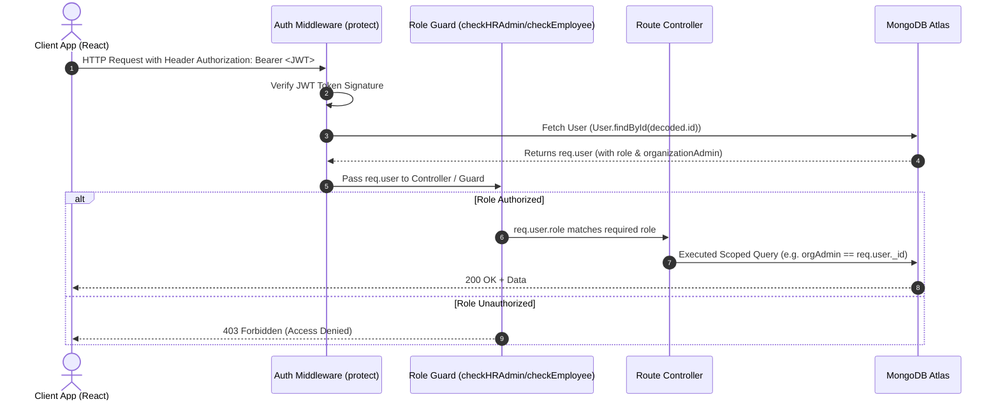

# 🔐 Role-Based Access Control (RBAC) Architecture

This document details how **Role-Based Access Control (RBAC)** and multi-tenant data isolation are designed and implemented in the **AI Insurance Policy Simplifier** system.

---

## 🎯 What is RBAC & Why is it Used?

**Role-Based Access Control (RBAC)** is a security model that restricts system access based on the assigned role of an authenticated user. Instead of assigning individual permissions to every single user, access rights are grouped into **Roles**.

### Benefits in this Project:
1. **Multi-Tenancy & Data Security:** Prevents corporate employees from viewing other organizations' policies.
2. **Feature Gating:** Restricts white-label branding tools to Insurance Agents and corporate employee management to HR Managers.
3. **Decoupled Security:** Enforces access rules consistently across database schemas, API routes, controllers, and frontend UI components.

---

## 👥 The 4 System Roles

| Role Key in DB | User Persona | Accessible Features & Capabilities |
| :--- | :--- | :--- |
| **`user`** *(Default)* | **Retail Policyholder** | • Upload & simplify personal policy PDFs/images<br/>• Generate AI claim denial appeal letters<br/>• Run side-by-side policy comparisons<br/>• Bookmark simplified summaries |
| **`agent`** | **Insurance Agent / Agency** | • All `user` capabilities<br/>• White-label agency profile (custom logo, primary color, contact info)<br/>• Share policy summaries via public agent links |
| **`hr-admin`** | **Corporate HR Manager** | • Upload & manage corporate benefit policies<br/>• Add, list, and delete employee accounts within their organization<br/>• Access HR Analytics Dashboard and AI query audit logs |
| **`employee`** | **Organization Employee** | • Access corporate benefit policies uploaded by their HR Admin<br/>• Ask AI-powered questions regarding policy coverage & claims |

---

## 🏗️ 4-Layer Implementation Architecture



---

### Layer 1: Schema Level Role Definition
* **File:** [`backend/models/User.js`](file:///e:/Study/Project/AI-Insurance-Policy-Simplifier/backend/models/User.js)

Roles are strictly validated using Mongoose `enum` strings. Corporate relationships link employee accounts to their HR Admin using `organizationAdmin`.

```javascript
// backend/models/User.js snippet
const userSchema = new mongoose.Schema({
  name: { type: String, required: true },
  email: { type: String, required: true, unique: true },
  role: {
    type: String,
    enum: ['user', 'agent', 'hr-admin', 'employee'],
    default: 'user',
  },
  organizationName: { type: String, default: '' },
  organizationAdmin: {
    type: mongoose.Schema.Types.ObjectId,
    ref: 'User',
    default: null,
  },
});
```

---

### Layer 2: Authentication & Context Injection
* **File:** [`backend/middleware/authMiddleware.js`](file:///e:/Study/Project/AI-Insurance-Policy-Simplifier/backend/middleware/authMiddleware.js)

The `protect` middleware decodes incoming JWT tokens (`Bearer <token>`), fetches the user record, and attaches `req.user` (including `req.user.role`) to the Express request object.

```javascript
// backend/middleware/authMiddleware.js snippet
const protect = async (req, res, next) => {
  if (req.headers.authorization && req.headers.authorization.startsWith('Bearer')) {
    const token = req.headers.authorization.split(' ')[1];
    const decoded = jwt.verify(token, process.env.JWT_SECRET);
    
    // Attach user to req object (including role & org reference)
    req.user = await User.findById(decoded.id).select('-password');
    next();
  } else {
    res.status(401);
    throw new Error('Not authorized, no token');
  }
};
```

---

### Layer 3: Controller Authorization Guards & Data Scoping
* **File:** [`backend/controllers/hrController.js`](file:///e:/Study/Project/AI-Insurance-Policy-Simplifier/backend/controllers/hrController.js)

Controller endpoints check role privileges and enforce multi-tenant boundaries:

#### 1. HR Admin Guard & Data Scoping:
```javascript
const checkHRAdmin = (req, res) => {
  if (req.user.role !== 'hr-admin') {
    res.status(403);
    throw new Error('Access denied. HR Admin privileges required.');
  }
};

// HR Admin can ONLY list employees in their own organization
const getEmployees = async (req, res) => {
  checkHRAdmin(req, res);
  const employees = await User.find({
    role: 'employee',
    organizationAdmin: req.user._id, // Data isolation boundary
  });
  res.json({ success: true, data: employees });
};
```

#### 2. Employee Guard & Policy Access Scoping:
```javascript
const checkEmployee = (req, res) => {
  if (req.user.role !== 'employee') {
    res.status(403);
    throw new Error('Access denied. Employee privileges required.');
  }
};

// Employee can ONLY view policies uploaded by their organization's HR Admin
const getEmployeePolicies = async (req, res) => {
  checkEmployee(req, res);
  const policies = await Policy.find({
    user: req.user.organizationAdmin, // Multi-tenant boundary
    isOrganizationBenefit: true,
  });
  res.json({ success: true, data: policies });
};
```

---

### Layer 4: Frontend UI Guarding & Navigation
* **Files:** [`frontend/src/atoms/authAtom.js`](file:///e:/Study/Project/AI-Insurance-Policy-Simplifier/frontend/src/atoms/authAtom.js), [`frontend/src/components/common/DashboardLayout.jsx`](file:///e:/Study/Project/AI-Insurance-Policy-Simplifier/frontend/src/components/common/DashboardLayout.jsx)

The React frontend uses Recoil state (`authAtom`) to store the logged-in user's role and dynamically adjusts UI navigation:

* **`user` / `agent`**: Renders Policy Simplifier, Comparison, and Claim Appeal tools.
* **`hr-admin`**: Renders HR Portal dashboard, Employee Management table, and Corporate Policy Uploader.
* **`employee`**: Renders Corporate Benefits portal and AI Policy Q&A interface.

---

## 📊 Complete Feature Permission Matrix

| Feature / Action | API Endpoint | Allowed Roles |
| :--- | :--- | :---: |
| Upload & Simplify Policy | `POST /api/policy/upload` | `user`, `agent`, `hr-admin` |
| View Personal Policies | `GET /api/policy` | `user`, `agent`, `hr-admin` |
| Compare 2 Policies | `POST /api/comparison` | `user`, `agent`, `hr-admin` |
| Generate Claim Appeal Letter | `POST /api/appeal` | `user`, `agent`, `hr-admin` |
| Manage Agency Branding | `PUT /api/auth/agency-profile` | `agent` |
| Add Corporate Employee | `POST /api/hr/employees` | `hr-admin` |
| List Organization Employees | `GET /api/hr/employees` | `hr-admin` |
| View HR Analytics & Query Logs | `GET /api/hr/stats` | `hr-admin` |
| View Corporate Benefits Policies | `GET /api/hr/policies` | `employee` |
| Ask AI Question on Benefit Policy | `POST /api/hr/policies/:id/ask` | `employee` |
